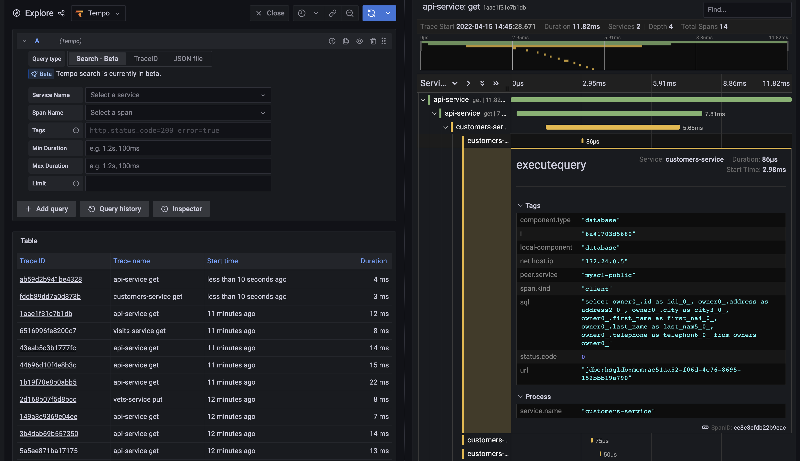
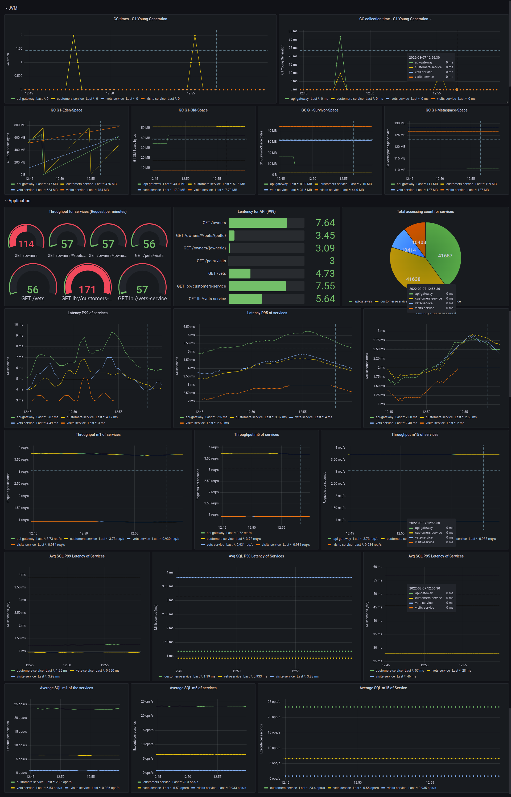

## Propose
Provide Easeagent users with an open source backend integration that can be delivered quickly, using Grafana + Tempo + Prometheus for the backend.

Reference to the following links:
```
https://github.com/grafana/tempo/tree/main/example/docker-compose
```


## Local Storage
In this example all data is stored locally in the `tempo/tempo-data` folder. Local storage is fine for experimenting with Tempo
or when using the single binary, but does not work in a distributed/microservices scenario.

1. First start up the local stack.

```console
docker-compose up -d
```

At this point, the following containers should be spun up -

```console
docker-compose ps
```
```
NAME                                 COMMAND                  SERVICE             STATUS              PORTS
tempo-local-easeagent-grafana-1      "/run.sh"                grafana             running             0.0.0.0:3000->3000/tcp
tempo-local-easeagent-prometheus-1   "/bin/prometheus --c…"   prometheus          running             0.0.0.0:9090->9090/tcp
tempo-local-easeagent-tempo-1        "/tempo -search.enab…"   tempo               running             0.0.0.0:51992->3200/tcp, 0.0.0.0:9411->9411/tcp
```

2. If you're interested you can see the wal/blocks as they are being created.

```console
ls tempo/tempo-data/
```

3. Start test demo project

- Build test project
```
git clone https://github.com/megaease/easeagent-test-demo.git

cd ease-test-demo/spring-gateway

mvn clean package

```
- Download Easeagent 
```
 wget https://github.com/megaease/easeagent/releases/latest/download/easeagent.jar
```

- Start demo

```
java -javaagent:easeagent.jar=agent.properties -Deaseagent.server.port=9902 -Deaseagent.name=demo-api -jar spring-gateway/gateway/target/gateway-service-*.jar
java -javaagent:easeagent.jar=agent.properties -Deaseagent.server.port=9900 -Deaseagent.name=demo-employee -jar spring-gateway/employee/target/employee-*.jar
java -javaagent:easeagent.jar=agent.properties -Deaseagent.server.port=9900 -Deaseagent.name=demo-consumer -jar spring-gateway/consumer/target/consumer-*.jar
```

- Access
```
curl -v http://127.0.0.1:18080/employee/message

curl -v http://127.0.0.1:18080/consumer/message

```

4. Navigate to [Grafana](http://localhost:3000/explore) and query tracing and metric data.

- Tracing


- Metirc dashboard


You can also access metric data through [Prometheus](http://localhost:9090)

5. To stop the setup use -

```console
docker-compose down -v
```
